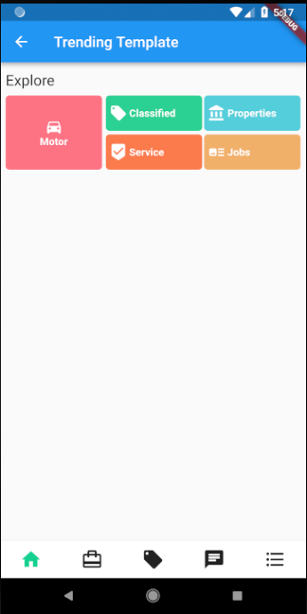
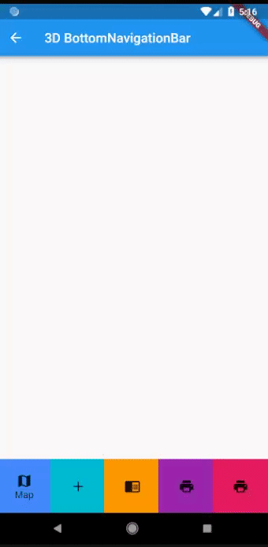
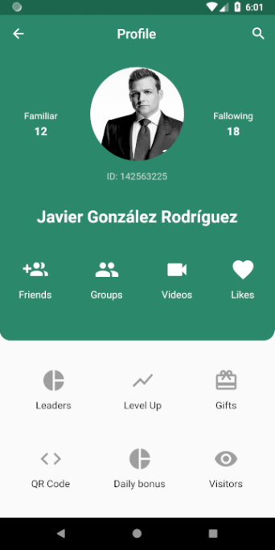
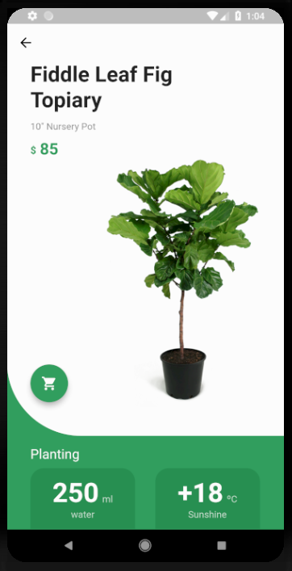
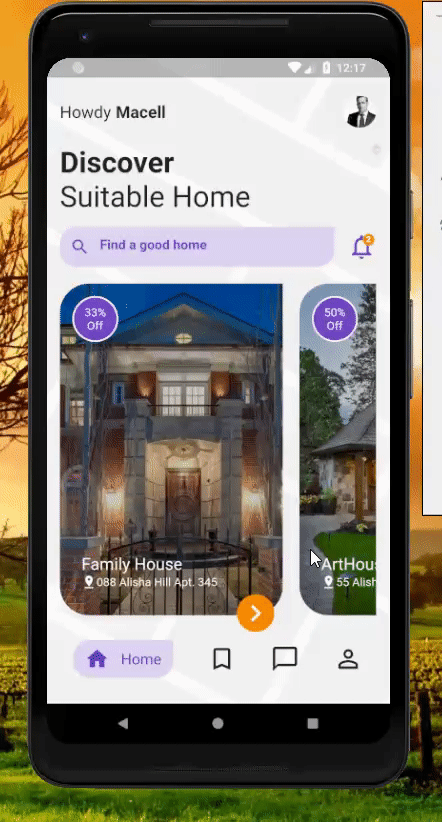
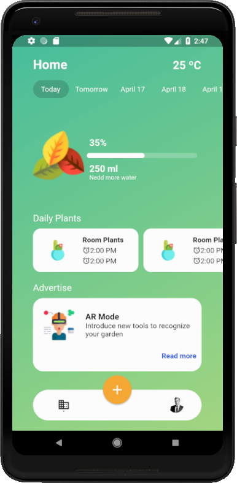
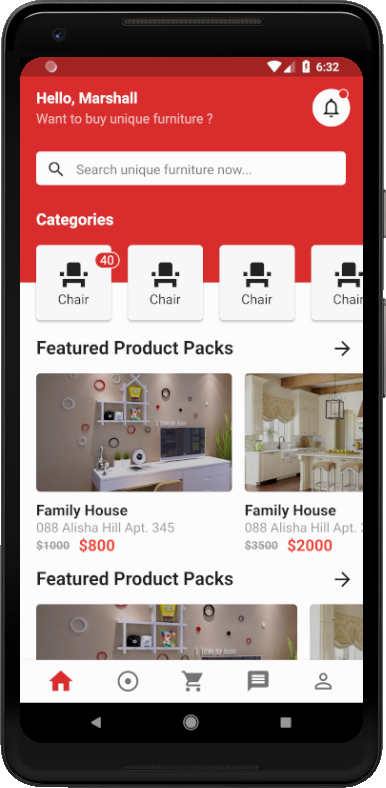
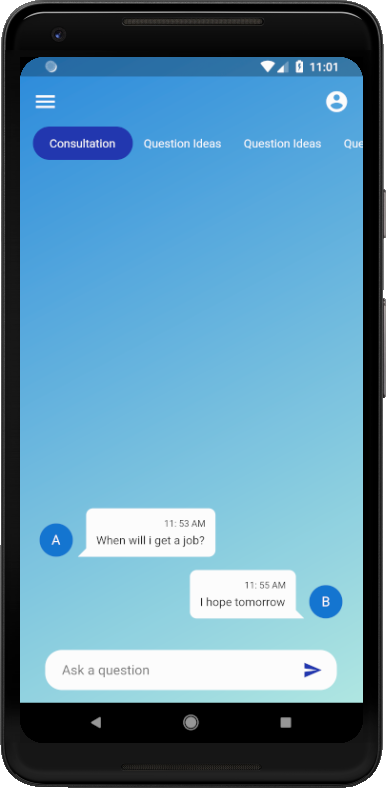

# Flutter UI demos

### Screenshots

       
   

### Created & Maintained By

[Javier González](https://github.com/javico2609)

[YouTube Channel](https://www.youtube.com/channel/UCF9uKbahHOibtuJdHxbCF9A)

## Social links

# Donate

> Si encontró útil este proyecto o aprendió algo del código fuente y quiere agradecerme, considere comprarme una taza de café. : )
>
> If you found this project helpful or you learned something from the source code and want to thank me, consider buying me a cup of cofee : )
>
> - [PayPal](https://www.paypal.me/javierglezrdguez)

Licensed under the Apache License, Version 2.0 (the "License");
you may not use this file except in compliance with the License.
You may obtain a copy of the License at

http://www.apache.org/licenses/LICENSE-2.0

Unless required by applicable law or agreed to in writing, software
distributed under the License is distributed on an "AS IS" BASIS,
WITHOUT WARRANTIES OR CONDITIONS OF ANY KIND, either express or implied.
See the License for the specific language governing permissions and
limitations under the License.

## Getting Started

For help getting started with Flutter, view our online  
[documentation](https://flutter.io/).
